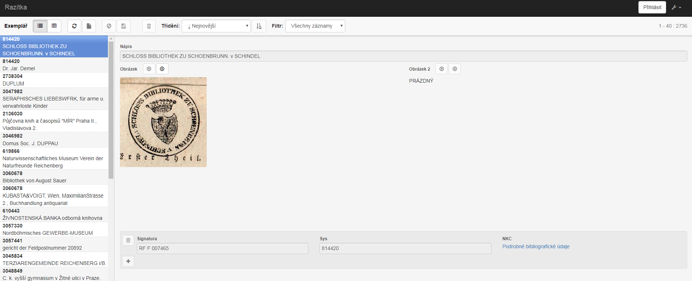
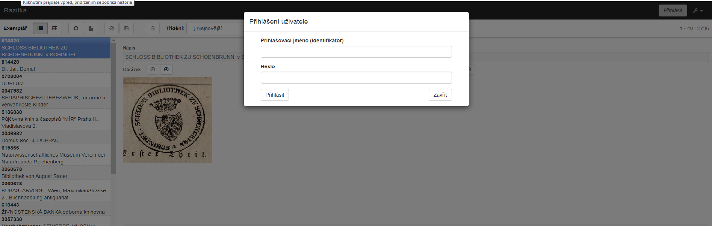
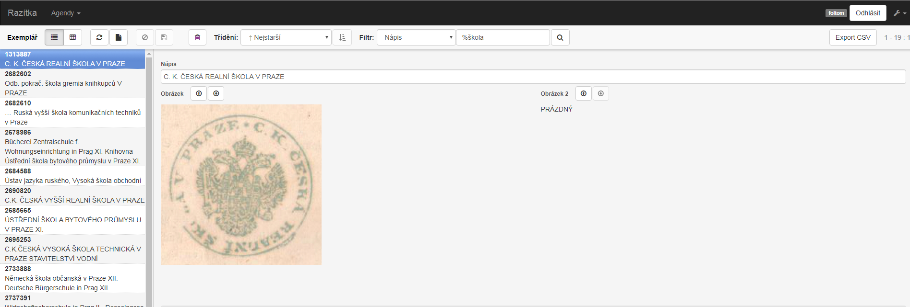
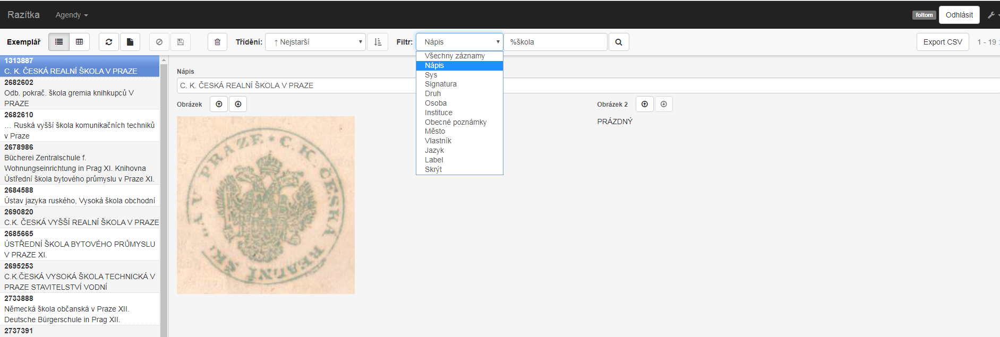
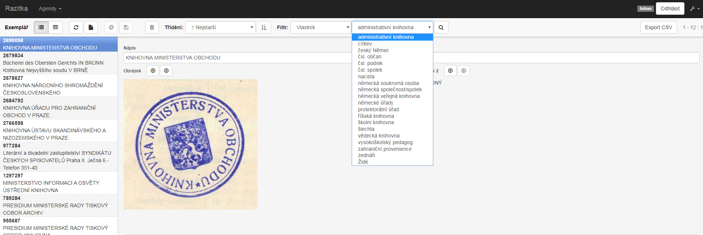
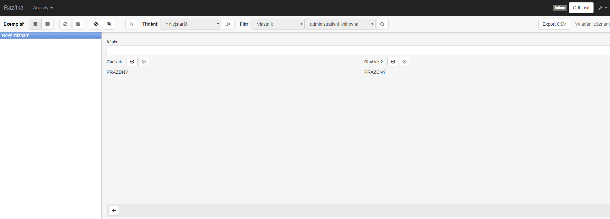
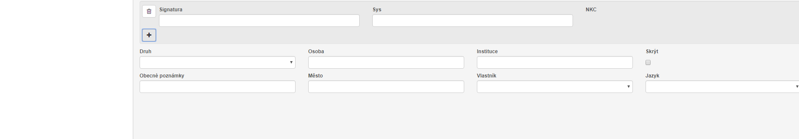

# Databaze provenienčních znaků 

Databáze slouží jako nástroj pro evidenci provenienčních znaků obsažených ve zpracovaných jednotkách deponovaných v Rezervních fondech NK ČR. 
Základní evidenční jednotkou (=1 záznam) je unikátní provenienční znak, kterým je nejčastěji razítko či exlibris původního vlastníka knihy. Ke každému jedinečnému záznamu jsou evidovány všechny doposud zpracované jednotky z RF NK ČR, které znak obsahují. 
Vedle informací vztahujících se k samotnému provenienčnímu znaku, kterými jsou pole „Nápis“, „Druh“ a „Jazyk“, umožňuje každý záznam editaci dalších známých polí ve vztahu k původnímu vlastníkovi knihy. Jedná se o pole „Osoba“, „Instituce“, „Město“, „Vlastník“, „Obecné poznámky“ a „Vlastník“ (=typologické zařazení původního vlastníka knihy). 
Bližší informace o původních vlastnících knih usnadňují výzkum pohybu knižních celků v období zhruba 30. – 50. let minulého století.

# Postup pro práci s databází původních vlastníků

## Vyhledávání záznamů

1. Pověřený zaměstnanec NK ČR (dále jen „uživatel“) se přihlásí do databáze původních vlastníků (dále jen „DB“) pomocí tlačítka přihlásit v pravém horním rohu.

2. Pro vyhledání konkrétního razítka si uživatel zvolí v poli filtr z rozevíracího seznamu parametr pro vyhledávání – nápis a do vedlejšího pole vyplní znak procenta a konkrétní hledaný výraz (např.: %škola).

3. Stejným způsobem postupuje uživatel v případě vyhledávání dle dalších parametrů: _sys, signatura, osoba, instituce, město, obecné poznámky_

4. Parametry vlastník a jazyk mají předem definovaný seznam, ze kterého může uživatel vybrat a filtrovat záznamy.

## Editace záznamů provenienčních znaků

1. Pověřený zaměstnanec NK ČR (dále jen „uživatel“) se přihlásí do databáze původních vlastníků (dále jen „DB“) pomocí tlačítka přihlásit v pravém horním rohu.

2. Před vložením nového záznamu uživatel nejprve ověří, zda DB již neobsahuje daný záznam. Pro toto ověření postupuje dle oddílu Vyhledávání záznamů. Pokud záznam existuje, postupuje uživatel podle bodu 7 tohoto oddílu.

3. Pro založení nového záznamu zvolí tlačítko nový záznam.

4. Uživatel vyplní povinně pole nápis (pokud se nejedná o grafické razítko/pečeť bez nápisu), druh a jazyk. 

5. Pomocí tlačítka plus (+) povinně vyplní pole signatura a sys jednotky, která obsahuje tento nový provenienční znak. 

6. Uživatel vyplní i další pole, jsou-li informace dostupné.

7. V případě, že záznam provenienčního znaku existuje, může uživatel přidat novou jednotku stejně, jako je uvedeno v bodu 5) tohoto oddílu.

