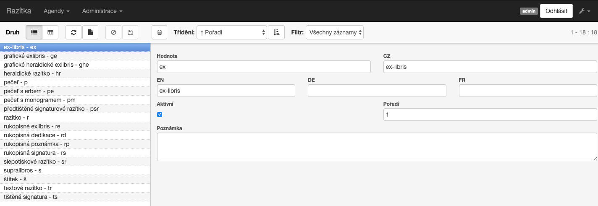
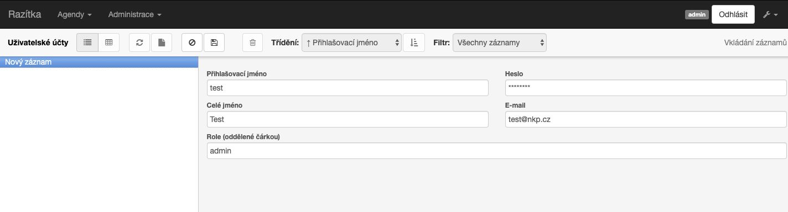

# Razitka NLP 

Databáze slouží jako nástroj pro evidenci provenienčních znaků obsažených ve zpracovaných jednotkách deponovaných v Rezervních fondech NK ČR. 
Základní evidenční jednotkou (=1 záznam) je unikátní provenienční znak, kterým je nejčastěji razítko či exlibris původního vlastníka knihy. Ke každému jedinečnému záznamu jsou evidovány všechny doposud zpracované jednotky z RF NK ČR, které znak obsahují. 
Vedle informací vztahujících se k samotnému provenienčnímu znaku, kterými jsou pole „Nápis“, „Druh“ a „Jazyk“, umožňuje každý záznam editaci dalších známých polí ve vztahu k původnímu vlastníkovi knihy. Jedná se o pole „Osoba“, „Instituce“, „Město“, „Vlastník“, „Obecné poznámky“ a „Vlastník“ (=typologické zařazení původního vlastníka knihy). 
Bližší informace o původních vlastnících knih usnadňují výzkum pohybu knižních celků v období zhruba 30. – 50. let minulého století.

